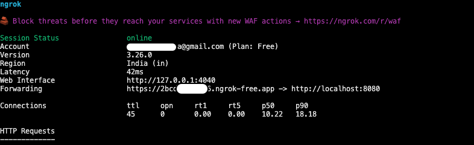

# Emma AI Girlfriend Chat Telegram Bot

### Features

- Understand Text, Photo, Animation, GIF, Audio

# Setup

#### 1. Official Telegram Bot to Create and Manage Bots

- https://telegram.me/BotFather

```
/help
/start
/newbot
```

- after setup you will get bot access `TELEGRAM_BOT_TOKEN`

#### 2. Set Webhook URL

to set Webhook URL we need public url to the server.

- but for Development purpose you can use [NGROK](https://ngrok.com/docs/getting-started/) : gives free public url to redirect reqs your local machine
  
  ```bash
  ngrok http http://localhost:8080
  ```
- `PUBLIC_WEBHOOK_URL`

#### 3. Gemini

- https://aistudio.google.com/apikey : `GEMINI_API_KEY`

#### 4. ENV

```bash
cp .env.example .env
```

#### 5. Start Server

```bash
npm run build
npm run start
```
